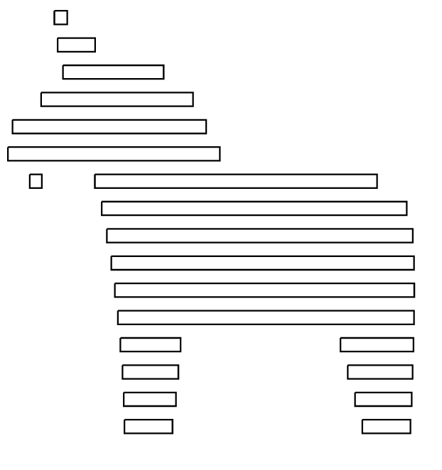

Components
===============

Below are the set of built-in components.  Additional custom components are available
via ``custom components``

draw
------------------------------------------------------------------------------------------
The draw component provides the basic drawing primitives to make shapes.  The draw commands
mostly correspond to svg path commands, but there are some useful additions.

Draw component should be in the form:

.. code-block::

    {
        "id": "my_drawing",
        "type": "draw",
        "commands": [
            {
                "command": "move",
                "to": "2,2"
            }
        ]
    }

Commands

* ``move`` Move the cursor to this position
    * ``to`` Point where to move to
* ``rel_move`` Move, with relative position.  This means that if the current position is 
                3,4 and ``to`` is 1,1 then the final position will be 4,5.
    * ``to`` Relative point
* ``line`` Draw a line to the requested point
    * ``to`` Point to draw a line to
* ``rel_line`` Same as line only using relative coords
    * ``to`` relative point
* ``line_by_angle`` Draw a line from current position by an angle and length
    * ``angle`` angle in degrees
    * ``length`` length of the line
* ``curve`` Draw a cubic bezier curve.
    * ``to``
    * ``ctrl_start``
    * ``ctrl_end``
* ``rel_curve`` Same as curve, but all points are relative
* ``smooth_curve`` A curve where the start control point is reflected from the
        end control point of the previous curve
    * ``to``
    * ``ctrl_end``
* ``rel_smooth_curve`` Same as ``smooth_curve`` with points relative
* ``circle`` Draw a circle
    * ``radius``
* ``rectangle`` Draw a rectangle
    * ``width``
    * ``height``
* ``round_corner`` Draws a 90 degree rounded corner
    * ``to`` The endpoint of the corner
    * ``radius`` the radius of the curve
    * ``corner`` The point where the corner would appear
* ``rel_round_corner``
* ``svg`` Draws an svg 'Path' 
    * ``svg`` The svg path string, (ex: "M 2,2 L 0,0").
* ``svg_scale_to`` Similiar to ``svg`` command. This is a special draw command which scales 
        the svg x and y so that the start point aligns with the previous endpoint and the endpoint 
        aligns to 'to'.  Note, this does not rotate the shape, it only scales in x and y.
    * ``svg`` The svg path string, (ex: "M 2,2 L 0,0").   
    * ``to`` Where to draw the svg to. 
    * ``reverse`` if true this will reverse the path        
* ``rel_svg_scale_to`` Samce as ``svg_scale_to`` but ``to`` is using relative coodrdinates
* ``svg_connect_to`` Similiar to ``svg_scale_to`` command. This is a special draw command which scales 
        and rotates the svg x and y so that the start point aligns with the previous endpoint and the endpoint 
        aligns to 'to'.
    * ``svg`` The svg path string, (ex: "M 2,2 L 0,0").   
    * ``to`` Where to draw the svg to. 
    * ``reverse`` if true this will reverse the path        
* ``rel_svg_connect_to`` Same as ``svg_connect_to`` but ``to`` is using relative coodrdinates

basic_edge
------------------------------------------------------------------------------------------

.. topic:: Examples

    * `<https://github.com/dustismo/heavyfishdesign/tree/master/designs/joints/line.hfd>`_

an edge is some form of a connection from x1,y1 to x2,y2.  

Typically an edge will be written to be reused as a custom component, where the ``to`` and ``from`` params are 
passed in. 

Parameters
~~~~~~~~~~

* ``handle``: When moving the edge what point should be considered the start.  Defaults
    to $ORIGIN
* ``to``: The point the edge should be drawn to
    The to point can take the following forms:

        .. code-block::

            x, y

        .. code-block::

            {
                "x": 5,
                "y": 6
            }

        .. code-block::

            {
                "angle" : 90,
                "length" : 5
            }
            // angle is in degrees where 0 is a straight line to
            // the right, and 90 is a line pointing to positive Y
   
* ``from``: The point the edge should be drawn from.  Defaults to current position
* ``edge_variable_name``: This is a special feature, if you set this name then certain Attributes of this edge will be available to all subsequently rendered components. See Global Variables

Global Variables
~~~~~~~~~~~~~~~

* ``<edge_variable_name>__length``: length of this edge
* ``<edge_variable_name>__angle``: the angle of this edge

repeat_edge
------------------------------------------------------------------------------------------

.. topic:: Examples

    * `<https://github.com/dustismo/heavyfishdesign/tree/master/designs/joints/finger_joint_plug.hfd>`_

an edge is some form of a connection from x1,y1 to x2,y2.  Edges are specifically designed to be useful
for joints, but can easily be used for other things.  

The repeat edge is a special variety of edge, that contains some repeatable element.
Each repeat edge contains three subcomponents left, repeatable, right.  (i.e. beginning, middle, end).
Each of the subcomponents should be drawn horizontally from origin 0,0.  The component
will stitch them together to make a continuous edge, and handle automatically handle 
moving and rotating. 

Typically an edge will be written to be reused, where the ``to`` and ``from`` params are 
passed in. 

Parameters
~~~~~~~~~~

* ``padding_left``: Additional amount that should be used on the left side before
    the repeatable starts
* ``padding_right``: see ``padding_left``
* ``handle``: When moving the edge what point should be considered the start.  Defaults
    to $ORIGIN
* ``to``: The point the edge should be drawn to
    The to point can take the following forms:

        .. code-block::

            x, y

        .. code-block::

            {
                "x": 5,
                "y": 6
            }

        .. code-block::

            {
                "angle" : 90,
                "length" : 5
            }
            // angle is in degrees where 0 is a straight line to
            // the right, and 90 is a line pointing to positive Y
   
* ``from``: The point the edge should be drawn from.  Defaults to current position
* ``left``: This should be a renderable component. it is the left most part of the edge.
	this should be stretchable and contains a special param
	called ``left_width``.  
* ``repeatable``: This should be a renderable component. it is the middle section, which will be repeated as many times as needed
* ``right``: Same as left, but has ``right_width`` special param
* ``edge_variable_name``: This is a special feature, if you set this name then certain Attributes of this edge will be available to all subsequently rendered components. See Global Variables

Global Variables
~~~~~~~~~~~~~~~

* ``<edge_variable_name>__length``: length of this edge
* ``<edge_variable_name>__angle``: the angle of this edge

xintercept
------------------------------------------------------------------------------------------

.. topic:: Examples

    * `<https://github.com/dustismo/heavyfishdesign/blob/master/designs/game_cabinet/speaker.hfd>`_

xintercept is a special component that allows you to render a repeatable shape horizontally 
into another shape. 

This is best described visually.  Here we have an outline of a dala horse, and 
we are drawing rectangles within it.  

And here it is if the outline were drawn in.

.. image:: _static/xintercept_dala_horse_3.png
  :width: 150

Parameters
~~~~~~~~~~

* ``outline``: <component> The shape that the repeatable should be drawn into 
* ``repeatable``: <component> The shape that should be repeated.  The repeatable
    shape will have the following params passed down to allow it to render the 
    proper size.
        * ``to__x`` The point to draw to
        * ``to__y`` The point to draw to
        * ``from__x`` The point to start from
        * ``from__y`` The point to start from
        * ``length`` the horizontal length 
* ``initial_spacing``: how much initial vertical space to add before drawing the first repeatable.
* ``repeat_spacing``: how much vertical space between each repeatable.
