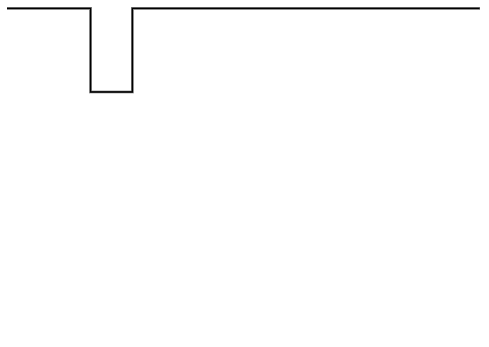
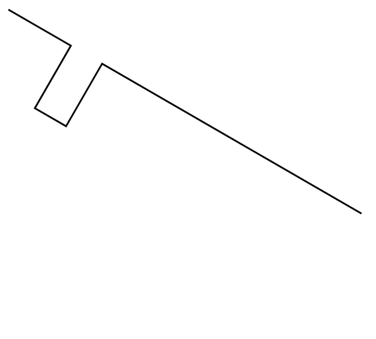
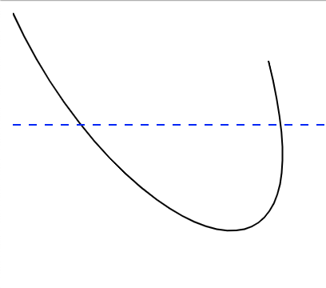
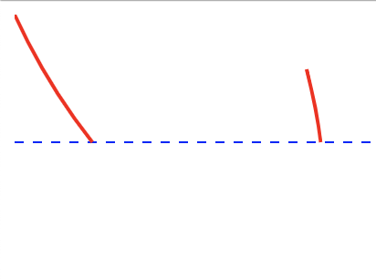

===============
Path Transforms 
===============

join
====
the join transform will join all segments into a continuous path.  It will make a 
best effort to rearrange segments to make the smoothest path.  For breaks in paths, the 
segments are extended until they meet. 

Attributes

* ``close_path``: 
    * ``true`` should the final segment be extended to 
        the meet the beginning of the path?
    * ``false``

.. code-block::

  "transforms" : [
                    {
                        "type" : "join",
                        "close_path" : false
                    }
                ]

------------------------------------------------------------------------------------------

matrix
=====

A matrix transform.  Performs an affine transform on all the points within the path. 

* ``a``
* ``b``
* ``c``
* ``d``
* ``e``
* ``f``

.. code-block::

  "transforms" : [
                    {
                        "type" : "matrix",
                        "a" : 1,
                        "b" : 0,
                        "c" : 0,
                        "d" : 1,
                        "e" : 1,
                        "f" : 1
                    }
                ]

------------------------------------------------------------------------------------------

mirror
======

Mirror will flip the path on either the horizontal or vertical axis

* ``axis``: 
    * ``horizontal`` will rotate around a horizontal line. Note that this means
        the bottom of the shape will become the top. 
    * ``vertical`` rotate around a vertical line. This means the 
        left of the shape will become the right
* ``handle``: Defines where on the shape the axis should pass through

.. code-block::

  "transforms" : [
                    {
                        "type" : "mirror",
                        "axis" : "horizontal",
                        "handle" : "$TOP_LEFT"
                    }
                ]

------------------------------------------------------------------------------------------

rotate
======

rotate will rotate by the specified amount

* ``degrees``: amount to rotate in degrees
* ``axis``: The axis point. This will be one of the HANDLE constants. Default is ``$TOP_LEFT``

.. code-block::

  "transforms" : [
                    {
                        "type" : "rotate",
                        "degrees" : 30
                    }
                ]

BEFORE:

AFTER:

------------------------------------------------------------------------------------------

scale
=====

Scale will shrink or expand the path

* ``width``: Will scale to the requested width.  if ``height`` is not provided then the scaling
            will be proportional
* ``height``: Will scale to the requested height.  if ``width`` is not provided then the scaling
            will be proportional
* ``scale_x``: Percentage to scale in the x direction, where 1 is no change, and .5 would be 50%
* ``scale_y``: Percentage to scale in the y direction, where 1 is no change, and .5 would be 50%

.. code-block::

  "transforms" : [
                    {
                        "type" : "scale",
                        "width" : 2.1
                    }
                ]

------------------------------------------------------------------------------------------

slice
=====

Slice will slice the component horizontally at the requested Y value and discard everything
below that.

* ``y``: The Y value to remove all segments below this line.  
        (Note below here means with a Y value > y, but appears below)

.. code-block::

  "transforms" : [
                    {
                        "type" : "slice",
                        "y" : 119
                    }
                ]

BEFORE:

AFTER:

------------------------------------------------------------------------------------------

trim
====

trim will remove any surrounding whitespace and move the bounding box
of the path to 0,0

------------------------------------------------------------------------------------------

cleanup
=======

Some basic path cleanup, the rendered path should not change in any way.
This will remove redundant Move operations and some other tasks
